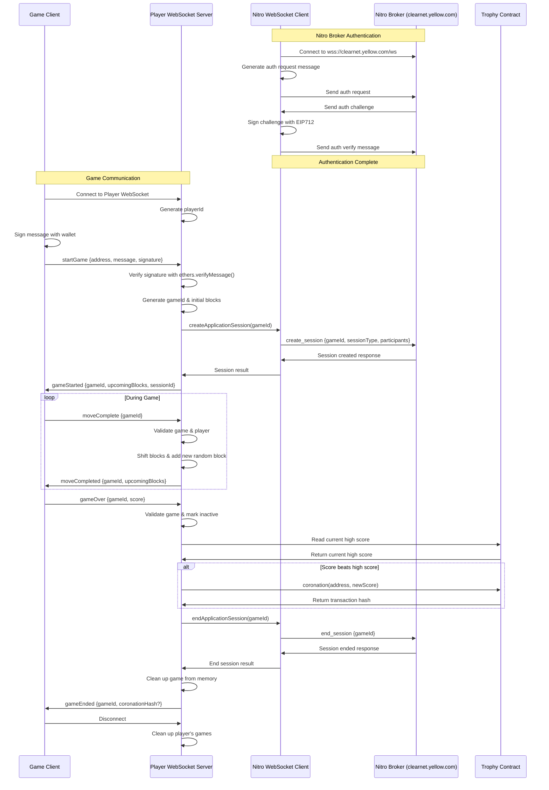

# yetris

yellow powered tetroids - who's the best player in the world? 

## Components

#### `client/`

This is the nextJS app deployed to https://yetris.vercel.app.

#### `state-channel`

This is an expressJS app that facilitates the off chain tetris game state, and submits the high score to the chain in the event that it is beaten.

#### `contracts`

This is a hardhat v3 program that has the Trophy NFT that is minted to the user whos able to get the new high score. It is currently deployed on polygon mainnet [here](https://polygonscan.com/address/0x6d64b04A8ec0dceb6304CC56845C665Fd454a0F1).

### Flow diagram

Below is a diagram on how the system application currently works.

### Improvements

- need to use the created application session to manage the game state (sttate diffs, atleast)
- need to validate the game score on the server as the game goes on, rather than at the end
- there's a bug in the game where it crashes and I'm not sure how to recreate
- mobile view of the app is pretty broken
- the leaderboard could probably be written to every game - not just the games where the high score is broken?
