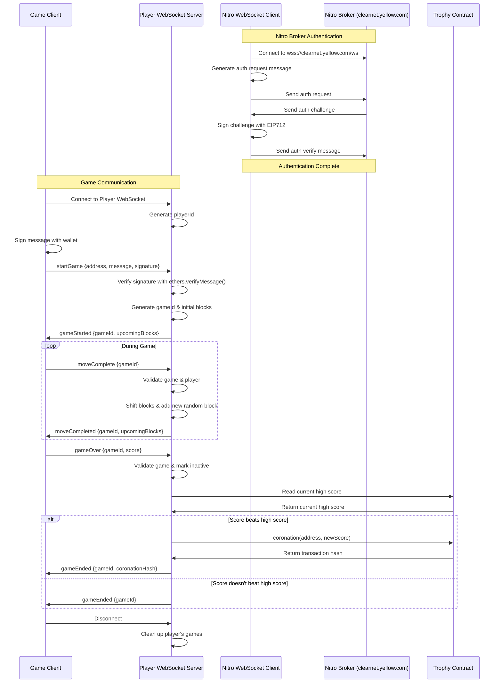

# yetris

yellow powered tetroids - who's the best player in the world? 

### Flow diagram

Below is a diagram on how the system application currently works.

### Improvements

- need to use the created application session to manage the game state (sttate diffs, atleast)
- need to validate the game score on the server as the game goes on, rather than at the end
- there's a bug in the game where it crashes and I'm not sure how to recreate
- mobile view of the app is pretty broken
- the leaderboard could probably be written to every game - not just the games where the high score is broken?
